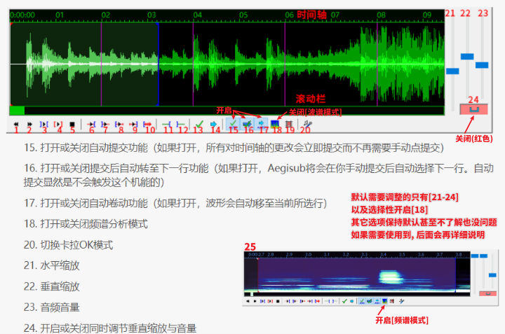

## 1.1 导入视频

您需要将一个`.H264编码(AVC)` `.mp4格式`的视频文件**拖入**至Aegisub中. 

> Aegisub不接受其他格式的视频. 或者说, 对于其它格式的视频只能做到部分兼容. 它极有可能导致类似于**时间轴错位**的情况. 
>
> 所以请不要试图将`.flv` `.mkv` `.ts`诸类常见格式的视频直接导入Aeg中. 

> 当您拖入视频的时候, 若出现一个 :no_entry_sign: ​或者出现弹窗 `[Error loading file]` / `[Error loading video]` , 就需要在Aeg中导入视频. 通过 **菜单栏**[**视频** - **打开视频**] 可以手动导入视频.

## 1.2 导入音频

您需要将一个 `.aac` `.mp3` `.flac` 格式的音频文件**拖入**Aeg中. 

或者通过**菜单栏**[**音频**-**打开音频文件**]打开一个音频文件. 

> 这种方式**只会导入音频**而不会导入视频, 常用于一些大型文件的合作制作. 譬如, 高达几G/几十G的视频文件, 负责下载源文件的成员可以通过**导出视频的音频**, 仅仅上传音频文件（几十至几百兆）的形式, 减少时间轴制作成员下载文件的时间. 

> 在制作普通的字幕时间轴时, 并不需要使用到视频, 通常只需要使用到音频. 所以我们首先需要先对音频区进行简单的设置.

## 1.3 音频设置

这是在制作字幕轴之前您首先需要了解到的部分, 以下这些设置能够帮助您更好的利用Aegisub制作字幕轴. 

> 
>
> 
[图1：音频区及其功能表] (from Aegisub 3.2 Manual)

音频区的功能稍微有些繁杂, 这里挑其中的使用频率更高的功能进行介绍. 其他功能比较简单, 在Aeg中鼠标悬停在对应功能上就有对应的介绍, 或者可以在Aegisub 3.2 Manual (简称Aeg手册) 中的[**时间轴** - **使用音频打轴**]一节中获得详细介绍. 

> 如果您想直接进行字幕轴制作, 您可以按照主音频谱(绿色)中进行设置, 或者按照频谱图[25]\(蓝色)进行设置.
>
> 即**开启功能15~17, 关闭功能24.**

首先**功能15-18**是推荐打开的功能, 这是一系列帮助更好的进行时间轴制作的功能. 

- [15] **自动提交**：该功能是一项**自动操作保存**. 如果不开启该功能, 相当于需要手动在"存档点"保存(提交保存). 

	> 您在音频区进行的每一次操作都会直接提交, 而不是只在您 **提交保存**[快捷键Enter / G] 时才进行一次保存. 该选项能帮助您避免误操作导致的字幕轴无效更改. 

- [16] **提交后自动进入下一行**：**提交时自动换行**. 

	> 您在**提交保存**的同时会进入下一行进行新的字幕操作, 若本行是最后一行字幕行, 则会创建一行持续时间为2s, 紧接在当前字幕行结束时间后面的字幕行. 
	> 若不勾选该功能, 那么**提交保存就只是保存**. 若想要进入或创建下一行, 则需要手动在字幕栏选择字幕行或右键字幕行**插入(选中)**. 

- [17] **自动卷动**：**自动跳转**至选中区域.

	> 您在字幕栏选中字幕行时, 音频区会自动跳转到对应的区块. 若不选中该功能, 则需要手动拖动音频区或使用功能[14]. 

- [18] **频谱/波谱模式切换**：这是两种不同的**音频显示模式**. 图例(绿色音频谱)显示的是波谱模式, [25]显示的是频谱模式(俗称鬼火模式)(蓝色音频谱). 使用波谱模式或是使用频谱模式进行字幕操作只看个人偏好. [[Aegisub手册 - 频谱与波谱](https://aegi.vmoe.info/docs/3.2/Timing/#section-3)]对两者进行了细微的差别介绍, 相对而言, 会更偏向于使用频谱进行字幕制作. 

- [20] **卡拉OK模式切换**：音频区**切换成卡拉OK模式**, 会在第五章对其进行详细介绍. 

- [21] **水平缩放**：**调整音频区的时间轴尺度**, 也就是调整单位长度表示的时间. 水平缩放可以在 [40%~100%] . 

	> 减小水平缩放会使音频区显示的时间轴尺度变大, 也就是能同时拉出一个超长的时间轴; 
	>
	> 增大水平缩放会使音频区显示的时间轴尺度变小, 也就是能够更加细致的操作时间轴. 
	>
	> 由于字幕规范, 所以我们对单行字幕轴的时间做出了限制 --- 一般而言单行字幕轴不超过7s, 所以水平缩放不宜过小.

- [22] **垂直缩放**：增加音频区显示的强度, 也就是**波谱模式中纵向的绿块**, 或**频谱模式中颜色显示的深浅**. 垂直缩放推荐 [40%~60% \(波谱模式)] \[100% (频谱模式)] . 

  > 过小的垂直缩放会让您"看不见"细微的声音.
  >
  > 一个合适的垂直缩放能够让您在字幕轴制作过程中更快更舒适地制作字幕轴. 

  > 如果您选择频谱模式, 那么推荐您在 `[设置-高级(音频)-频谱模式]` 中更改**频谱质量**为[**高质量**]或[**极高质量**], 并根据电脑配置提供更多的最大缓存. 这会使得您的频谱光谱更加的清晰, 帮助您更好的进行制作. 

- [23] **音频音量设置**：建议调整至 [40%\~50%] 并不作后续更改, 若想调整音量请调整系统音量. Aeg的音量条并非 [0\~100%] , 而是 [0\~200%(估算)] . 音量条过高会**导致音频严重失真**. 

- [24] **垂直缩放&音量同步**：**不推荐您开启该功能**, 通常来说垂直缩放和音量设置并不能够达成同步状态. 

---

| [< 目录](../README.md) | [第二节: 操作与规范 >](./2.%20操作和规范.md) |
| ------------------------------- | ------------------------------- |

