## 2.1 基础操作

> 注: 对于音频区的**水平缩放**, 本人更习惯于小尺度的时间轴操作, 故本书的图示都是以本人的习惯为主. 在实际的字幕轴制作过程中, 您需要自己逐渐熟悉属于自己的音频区设置和操作. 

> 由于本页图片较多, 加载可能需要一些时间.

### 2.1.1 隐藏视频区

> 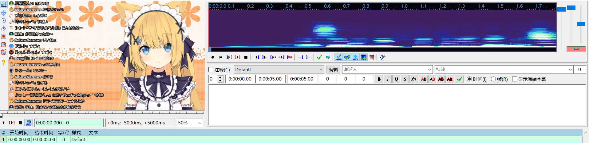
>
> 
[图2-1：初始界面(导入视频)]

导入视频之后, 您将看到如图2-1所示画面. 为了更方便地操作音频, 可以将**视频隐藏** [**菜单栏(查看)** - **音频+字幕模式**]\(见图2-2)  , 得到一个更加完整的音频区. 

> 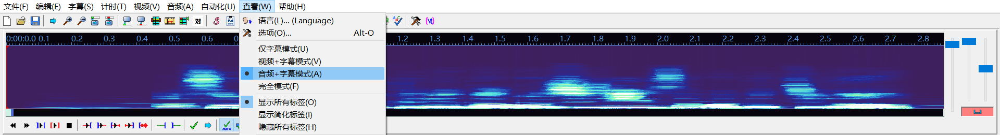
>
> 
[图2-2：更为完整的音频区]

> 通过 [**菜单栏(视频)** - **关闭视频**] 也可以隐藏视频区只保留音频区, 但这种方式是直接关闭视频, 若想打开视频区查看, 则需要再次从外部导入视频. 而上述的隐藏视频想查看视频区只需再次更改选项 [**菜单栏(查看)** - **完全模式**] .

---

### 2.1.2 制作单行字幕

> 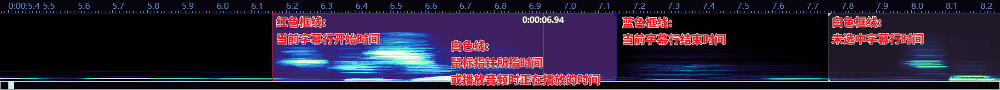
>
> 
[图2-3：修改一行字幕的时间]

当您的鼠标指针指向音频区时, 会出现一条**白线**, 这条白线表示**当前选中时间**. 

如果**单击鼠标左键**, 那么该行的开始时间就会被锚定到白线处, 同时将修改开始时间; 
如果**单击鼠标右键**, 那么该行的结束时间就会被锚定到白线处, 同时将修改结束时间. 

通过如此, 我们能够快速制作一行字幕. 

---

**完整的音频**: 可以看到, 图2-3(频谱模式)中, 存在一条连续的不规则白色色块, 这表示**一段连续的"人声"**, 我们可以依此来迅速划分出一行字幕. 若是一些其它的杂声, 则会显示为规则的淡蓝色条状色块, 并不会有明显的白色. 

下图是波谱模式和频谱模式的声音区分: 

> 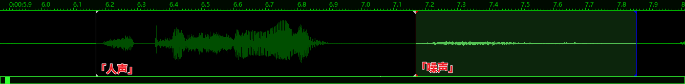
>
> 
图2-4：波谱模式人声/噪声形状区分

> 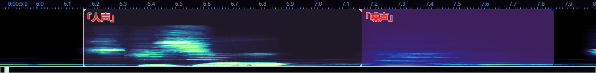
>
> 
[图2-5：频谱模式人声/噪声形状区分]

在一般情况下, 两种模式并无强区分. 

但是, 当背景中存在大量噪声/背景存在音乐时, 频谱模式两种不一样的色块能够帮助您更好的分辨人声的开始和结束, 而波谱模式的噪声的色块则会掩盖掉一部分人声的色块. 

### 2.1.3 制作多行字幕

在制作完一行字幕轴并**检查***完之后, 您就需要开始制作下一行字幕轴, 使用快捷键[Enter]或者快捷键[G]可以提交并进入下一行, 该快捷键能让您进入当前选中字幕行的下一行字幕行, 或者在当前选中字幕行是最后一行时, 紧随其后创建一行时间为2s的空白行. 

> 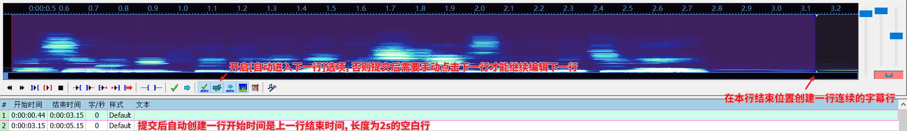
>
> 
[图2-6：提交编辑并进入下一行]

> **检查***: 一行字幕轴需要满足若干规范的要求才能算为一行合格的字幕轴. 详见下文[[2.1.4 字幕轴规范](#214-字幕轴规范)].
>
> **快捷键**: 推荐绑定**鼠标侧键**为提交快捷键, 或者对您更为舒适的键盘快捷键, 因为制作字幕并不仅仅只需要用到提交. 修改快捷键见下文[[2.1.5 快捷键设置](#215-快捷键设置)]

> 若存在提交后未进入下一行, 或是在最后一行提交没有创建一行新字幕行, 请检查您的[自动进入下一行]选项是否开启(见图2-6). 

### 2.1.4 字幕轴规范

字幕轴规格本质上的原则只有一个——提升观众的观感. 

如果您觉得您做出来的字幕看着连自己都难受, 那么这个字幕毫无疑问就是失败品. 

---

1. **时间留白**: 开始时间紧贴对话(50ms以内), 结束时间需存在留白(100ms~300ms)

> 开始时间和结束时间指**字幕轴**的开始时间和结束时间, 对话指实际发出的音频.(见图2-7) 

> 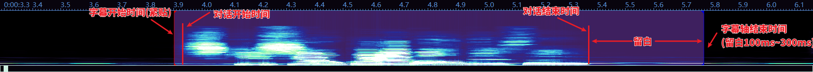
>
> 
[图2-7：时间轴开始结束时间要求]

> 字幕开始时间的要求并不严格, 由于可以从频谱的色块迅速得知对话的开始和结束时间, 所以稍微在之前一点卡住开始时间就可以. 唯一的要求只有: 不吞音. 
>
> 您可以使用快捷键[Q]-**播放字幕开始时间前500ms的音频**(**红色框线左侧**)来检查有没有吞音的情况. (可查看图2-8了解为什么需要快捷键检查)

> 字幕结束时间的要求是保留100ms\~300ms的空白, 甚至保留100ms\~500ms也是可以的, 也就是只要不跟着对话结束一并结束字幕就可以. 鼠标稍微往后一甩就可以, 并没有太多的限制.
>
> 您可以使用快捷键[D]-**播放字幕结束时间前500ms的音频**(**蓝色框线左侧**)和快捷键[W]-**播放字幕结束时间后500ms的音频**(蓝色框线右侧)来检查对话是否完整. 

> 若对话结束是以一段拉长音结束(如"这样啊\~\~\~"), 可字幕轴跟着拉长音结束一并结束, 不必延长. 

---

2. **时间连续**: 若两行字幕轴之间的间隔时间小于300ms, 需将前一行的结束时间延长至后一行的开始时间. 

	可以通过快捷键 `[右键字幕行 - 使时间连续(更改结束时间)(M)]` 将前一行的结束时间延长至后一行的开始时间. (见图2-8)

> **注**: 这里的"两行字幕轴"是指两行由您编辑的字幕轴, 而不是固定的对话. 也就是说, 如果两行对话之间的时间间隔是500ms, 但由于时间留白的原因, 这两行对话对应的两行字幕行之间的间隔小于300ms, 这也是需要时间连续的. 
>
> 时间间隔小于300ms的字幕会出现"**闪轴**"的情况, 也就是字幕会突然一闪消失再出现, 这种字幕看的时间久了会让观众的眼睛感到不适. 

> 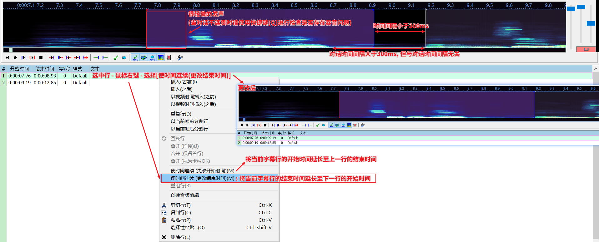
>
> 
[图2-8：更改字幕轴结束时间使两行相邻字幕轴连续]

> 若两行字幕轴是一句完整的话被拆分成两句话, 那么可视为这两行字幕轴是连续的. 可直接将前一行的结束时间连续至后一行的开始时间(忽略时间间隔). 

> 但是呢, 如果所有时间间隔都很短的字幕轴需要我们手动去更改结束时间, 那制作一个字幕所需的时间成本那就太大了, 所以我们有更简便的方法: **将前一行字幕轴的结束时间直接延长到后一行字幕轴的开始时间**, **再提交创建新一行字幕轴**. 这样就不用手动连续字幕轴时间, 而且后一句的开始时间也已经编辑完成了. (您可以通过图2-9查看该
>
> 您可以使用快捷键[D]-**播放字幕结束时间前500ms的音频**(**蓝色框线左侧**)来找到后一行字幕轴的开始时间, 这一步等同于后一行的**检查吞音**一样.

---

3. **时间延长**: 短于500ms的短句需延长至500ms以上.

> 如果按照规则1延长结束时间, 一般是不会存在短于500ms的句子, 这种短句一般是语气词之类的. 少于500ms的字幕正常人类的阅读速度是无法认知的望须知. 

> 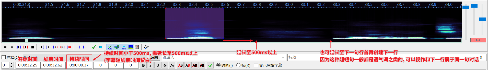
>
> 
[图2-9：短句延长规则的两种应用]

> 其实这种短句延长规则更多的应该被用于的是**注释**上, 但是经常会被忽略. 
>
> 有些字幕是一些注释的, 譬如主播念弹幕, 或者字幕存在需要解释的专业术语之类的. 但是通常会将这种注释和字幕轴的时间保持一致, 但这并不是一个最优解. 因为有些字幕轴的时间很短, 而且观众不仅仅需要看字幕, 还要看注释, 这需要更多的时间. 
>
> 所以这里推荐的是注释的时间最好大于2s, 若存在超长注释则需要根据文本量适当再延长注释的时间. 当然, 这期间对话字幕轴的时间还是照常进行的. 

---

4. **时间不重叠**: 单人对话的视频, 不允许出现**字幕轴时间重叠**(字幕编辑栏会报红)(见图2-10)或字幕轴文本过长出现2行文本的情况, 或者字幕文字过长超出屏幕长度$\frac{2}{3}$的情况. 
	**字幕时间不宜超过7s**. 

> 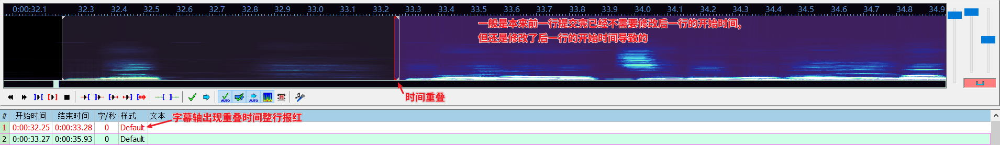
>
> 
[图2-10：重叠时间轴]

> 如果存在多行时间重叠的字幕轴, 或者存在两行文本的字幕轴, 那么字幕就不会是一个固定的位置, 观众就需要去"寻找"字幕. 同样的, 超出屏幕$\frac{2}{3}$的文本也需要观众去"寻找"字幕. 
> 我们的初衷是在提供字幕的同时尽力减少字幕占用画面带来的突兀感, 如果让观众去寻找字幕, 那么这种突兀感就会放大, 而且观众寻找字幕也会占用观看视频的注意力. 
> 人的识别系统是会存在惯性的, 如果字幕一直在同一个位置, 那么大脑会默认这个位置就是字幕并直接开始识别. 但如果字幕位置一直变换, 即需要一直去寻找字幕再开始识别文字, 这会极大减少观众的观看体验(观看流畅度). 

> 字幕轴文本过长出现2行文本和字幕文字过长超出屏幕长度$\frac{2}{3}$这两种情况在开始制作时间轴的时候并不好判断, 因为通常都是先制作时间轴再填充文本. 那么应该怎么做呢? 
> **字幕时间不宜超过7s**这一条规则就是前两条规则的延伸. 在制作空白时间轴阶段避免产生过长的字幕轴, 那么在填充文本阶段就会减少相应的工作量. 那么我们又了解到了: **制作时间轴应以短句为主**. 

---

**快捷键设置修改**: 

> 这里是笔者的设置, 可作为参考.

由于[Q]\[W]\[E]\[D]这四个播放音频前后时间的快捷键比较混乱难记, 所以笔者按照顺序将其更改为:

- [Q] :  播放字幕开始时间前500ms的音频(红色框线左侧) 
- [W] : 播放字幕开始时间后500ms的音频(红色框线右侧)
- [E] : 播放字幕结束时间前500ms的音频(蓝色框线左侧) 
- [R] : 播放字幕结束时间后500ms的音频(蓝色框线右侧) 
	(删除原快捷键[R] - [audio/play/line] - 播放当前行, [空格]绑定有播放当前行的热键指令)

### 2.1.5 快捷键设置

> 注: 本小节不是必须了解的章节. 
>
> 本小节只对快捷键的设置做介绍以便您能够调整出适合您的键位, 而且不做快捷键设置推荐, 与其它章节和字幕轴制作没有直接联系.
>
> 若存在需要使用到的常用快捷键, 在介绍对应功能时会相应介绍, 没有介绍到的快捷键则说明不是很重要的快捷键. 

您可以通过 [**菜单栏**(**查看**) - **选项**] 或者点击功能区的  按钮进入设置界面, 通过 [**选项** - **界面**(**热键**)] 进入热键设置界面. 

---

设置快捷键前需要稍微了解一下热键区, 这是后面编辑快捷键的关键.(图2-11) 

热键区顾名思义, 每一个热键(快捷键)都存放于自己的区域, 超出这个区域那么这个热键就不会生效. 

> 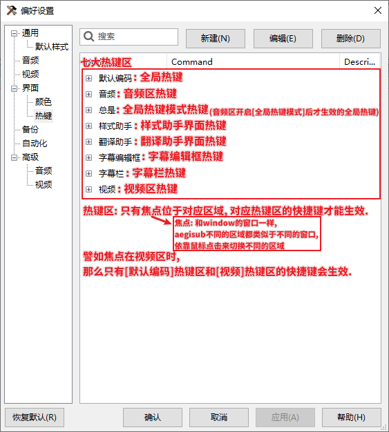
>
> 
[图2-11：热键区和焦点]

首先就是[默认编码]这个热键区代表的全局热键, 其中的快捷键全部都能够直接使用. 

然后就是[音频] [视频] [字幕编辑框] [字幕栏]这四大热键区, 只有选中了对应区域之后, 对应热键区的快捷键才能使用. 

[样式助手]和[翻译助手]是两个很不常用的辅助界面, 可以通过 [**菜单栏**(**字幕**) - **样式助手**/**翻译助手**] 打开这两个界面. 

[总是]这个热键区比较特殊, 它需要在音频区打开[切换全局热键模式]\(图1-1选项[19])之后才能生效(全局). 但是特殊并不代表这是个好用的热键区, 相反它很不必要. 如果想要一个全局热键, 可以通过[默认编码]热键区建立, 如果想要一个音频区热键, 可以通过[音频]热键区建立, 并不需要这一个特殊的热键区, 频繁的开启关闭反而十分繁琐. 

所以我们设置快捷键主要就在[默认编码] [音频] [视频] [字幕编辑框] [字幕栏] 这五个热键区里进行设置. 

---

**设置热键**: 

> 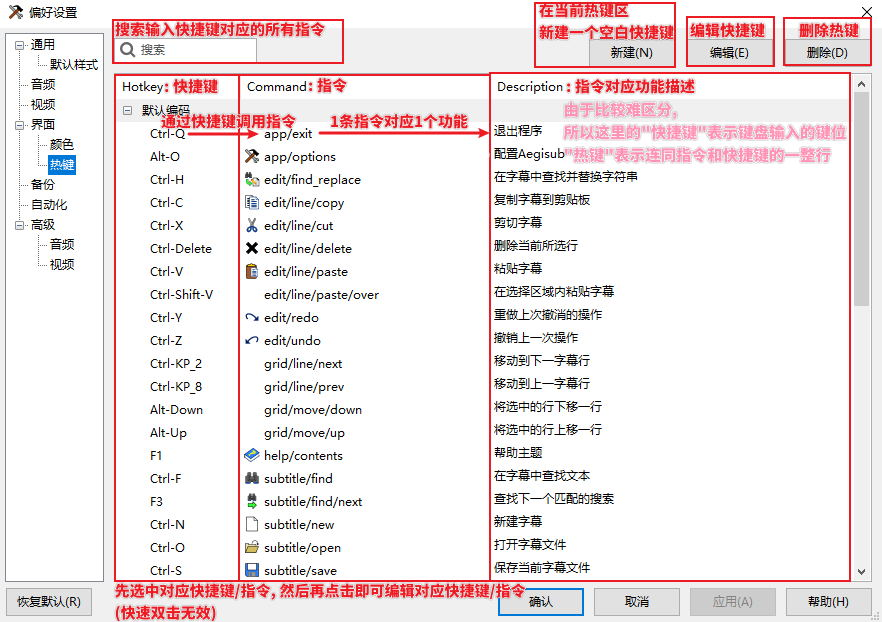
>
> 
[图2-12：快捷键新建和修改]

修改热键比较简单, 只要先选中对应的行(整行变蓝), 然后单独点击快捷键/指令(不能连续双击), 就可以进行修改编辑了. 

如果想要新建热键, 那么首先需要明确需要的是一个全局热键还是局部热键. 
这里推荐除非真的想要一个全局热键, 如果只是想要在多个区域(例如音频区和视频区)创建一个相同的热键, 那么在这两个热键区设置两个相同的热键会比直接设置一个全局热键会更好一些. 因为如果设置成全局热键, 那么可能哪天在编辑文本/操作字幕栏的时候就可能触发到这个热键造成一些不想要的效果. 

新建热键的编辑和修改热键一样. 

---

可在[[Aegisub手册 - 热键](https://aegi.vmoe.info/docs/3.2/Commands/zh_CN/)]中查询到所有热键指令. 

---

| [`< 第一节: 导入和音频设置`](./1.%20导入和音频设置.md) | [`第三节: 文本导入和样式 >`](./3.%20文本导入和样式.md) |
| ------------------------------- | ------------------------------- |