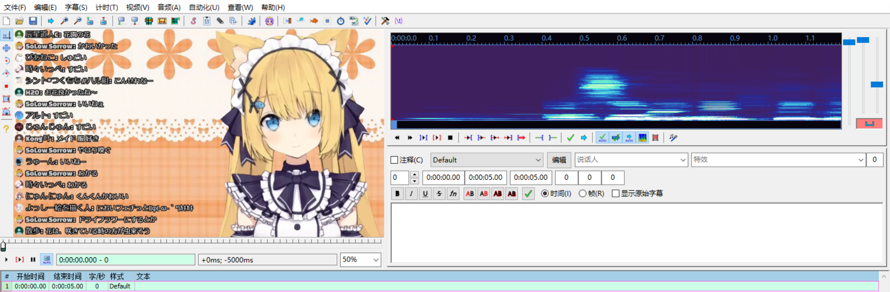
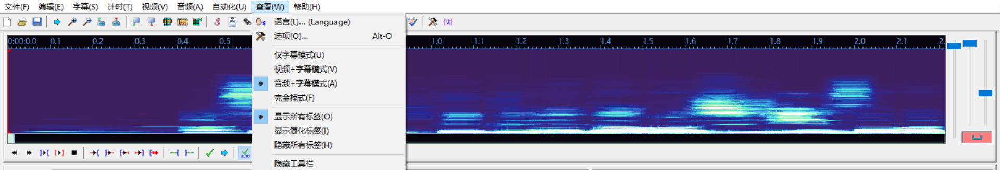

> 注: 对于音频区的**水平缩放**, 本人更习惯于小尺度的时间轴操作, 故本书的图示都是以本人的习惯为主. 在实际的字幕轴制作过程中, 您需要自己逐渐熟悉属于自己的音频区设置和操作. 

## 2.1 基础操作

### 2.1.1 隐藏视频区

> 
>
> 
图2：初始界面(导入视频)

导入视频之后, 您将看到如下画面. 为了更方便地操作音频, 可以将**视频隐藏** **菜单栏**[**查看** - **音频+字幕模式**]  , 得到一个更加完整的音频区. (也可以直接关闭视频 **菜单栏**[**视频** - **关闭视频**] )

> 
>
> 
图2：更为完整的音频区

